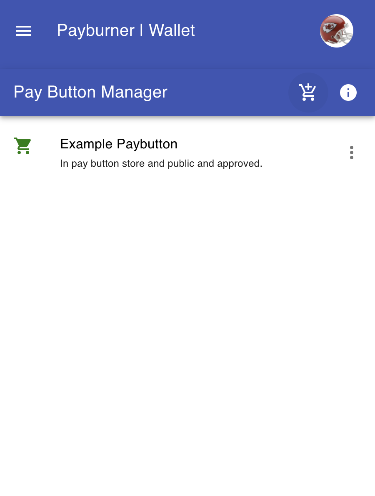

## Using this component

To create pay buttons:

- You first need to have a Payburner Wallet (click to <a href="https://chrome.google.com/webstore/detail/ghigcfhmoaokccllienfhdhdndkfhmop/publish-accepted?authuser=3&hl=en">install</a>)
- In your Payburner Wallet, click on your profile icon, and then open `Pay Button Manager`.

You will then see the Manager

 

- Click on the `+ shopping cart ` icon and then enter the information for your pay button.

Note that there are two types of paybuttons -- ones with a fixed price and ones without a fixed price.  Fixed price
buttons could be used for purchasing a specific item, for example.  Non-fixed priced buttons could be used for a shopping 
cart payment where the price is dynamic and calculated.

- Once the pay button has been created, Click on the `more` icon and then select `Embed`.  You will receive instructions for installing the pay button.
 

You will see specific instructions for embedding your paybutton:
 

There are two key parts of embedding a paybutton in a simple HTML page. 

First you must import two scripts:

- `` in the head of your index.html to import payburner.       
- `` in the head of your index.html to load the component

Note that the order is important -- first payburner.js, then paybutton.js.  

Payburner.js is the library connects the page to the Payburner Browser Extension.  Paybutton.js is a 
web component for adding the paybutton to your page.

With the two scripts imported, you can now specify paybuttons anywhere on your page.

- Then you can use the element anywhere in your template, JSX, html etc
   <pay-button buttonid="7b2d5583-a178-434d-8048-516f784f8f92" ></pay-button>
   
Click here for a [Simple Example](./examples/html/simple-example.html)

